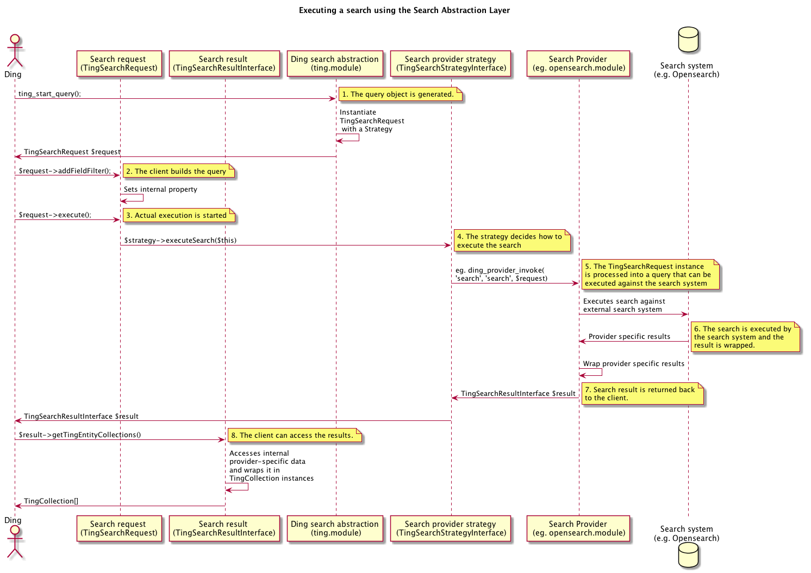

# Ding Search Abstraction layer

The search abstraction layer sits between ding and a external search system. 
The abstraction layer makes it possible to move between different 
search/well-implementations without altering the calling code.

## Examples
Printing the title of up to 50 books all books matching "Harry Potter" from year 2016 or 2017:
``` PHP
$results = ting_start_query()
  ->setFullTextQuery('Harry Potter')
  ->addFieldFilter(TingSearchCommonFields::MATERIAL_TYPE, 'Book')
  ->addFieldFilters([
    new TingSearchFieldFilter(TingSearchCommonFields::DATE, 2016),
    new TingSearchFieldFilter(TingSearchCommonFields::DATE, 2017),
  ], BooleanStatementInterface::OP_OR)
  ->setCount(50)
  ->addSort(TingSearchCommonFields::TITLE, TingSearchSort::DIRECTION_ASCENDING)
  ->execute();

if ($results->getNumTotalCollections() > 0) {
  foreach ($results->getTingEntityCollections() as $collection) {
    print $collection->getPrimary_object()->getTitle();
  } 
  else {
    print 'No results returned';
  }
)
```
## Search execution flow



First step in any searches using the Search Abstraction Layer begins with an 
invocation of ```ting_start_query()``` which returns an instance if 
```TingSearchRequest```. The request is instantiated with a Strategy that is 
used when the query is executed to perform the actual execution.

1. ```ting_start_query()``` is used to generate TingSearchRequest instance
2. The client-code then builds the query using the request object. All 
   query-building is kept in the object. That is, the search provider is not
   interacted with at this point.
3. When the query has been build, it is executed via the ```execute()``` method
   on the object. The query object delegates the execution of the search to its
   embedded Strategy passing itself along.
4. The strategy decides how the query is to be executed and delegates. The 
   current implemented strategy uses ```ding_provider_invoke``` to delegate to
   a search provider.
5. The search provider now processes the TingSearchRequest and translates it 
   into an actual query that can be executed against the search system. For 
   Opensearch this includes building up a CQL expression and configuring the
   ting-client with eg. paging.
6. The search is executed and the search result is converted or wrapped An 
   implementation of TingSearchResultInterface.
7. The result is passed back to the client.
8. The client can subsequently access the search-results. It is up to the 
   implementation whether to convert from internal data to Ting compatible 
   objects on the fly, or whether this is done up front.         
